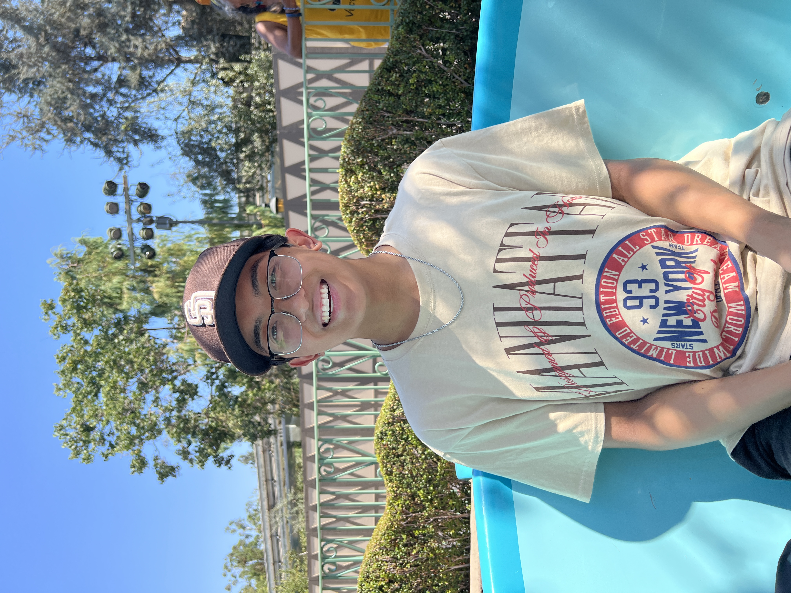

# Hello!

My name is **Noah Jaurigue** and welcome to my *user page*!
```
class NoahJaurigue{
    static List<String> getInContact(){
        List<String> myContacts = 
            Arrays.asList(
                "Email: noahdj37@gmail.com",
                "GitHub: github.com/njaurigue",
                "LinkedIn: linkedin.com/in/noah-jaurigue/",
                "Instagram: @noahjaurigue"
            )
        return myContacts
    }
}

```
> You can find the links above and more at the [bottom of this page](https://github.com/njaurigue/CSE110-Lab1-userPage/blob/main/index.md#links)!



In my free time, I enjoy
- collecting vinyl records,
- watching sports (especially American Football!),
- and spending time with friends!

And here are the most difficult classes I am taking this quarter:
1. CSE 140
2. CSE 110
3. CSE 140L
4. COGS 101B
5. LIGN 8

Some upcoming tasks/projects I'd like to complete include:
- [ ] Learn Cypress.JS
- [ ] Learn React.JS
- [ ] Spotify Monthly Summary Application
---
## Links!
[GitHub](https://github.com/njaurigue)\
[LinkedIn](https://www.linkedin.com/in/noah-jaurigue/)\
[Portfolio](https://noahjaurigue.com/)\
[Take a look at the README here](README.md)